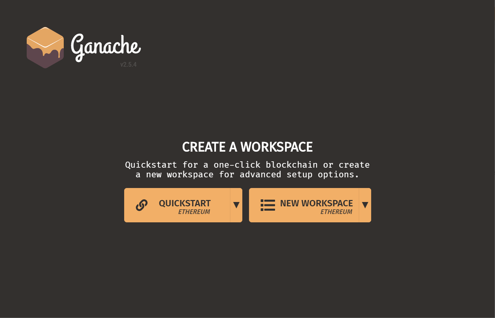
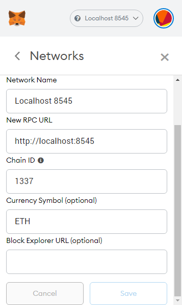
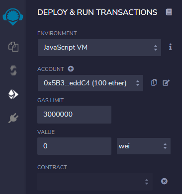

## Set up

### Install a local server

[Ganache](https://www.trufflesuite.com/ganache) is a great GUI for quickly spinning up an easily usable local blockchain in just a few clicks. **This is the recommended route for this course**, since we won't be able to spend a lot of time helping everyone get a more complicated solution up and running. Feel free to explore the other solutions if you're feeling adventurous.

If you want to explore the [Truffle CLI](https://www.trufflesuite.com/truffle) for yourself, it also comes with a development server.

Alternatively, you can download and run a [full Ethereum node](https://geth.ethereum.org/) for your dApp development setup.

### Install Metamask

[Metamask](https://metamask.io/) is a browser extension that allows websites to connect to an Ethereum network, whether mainnet, testnet, or any other RPC provider (like a local Ganache instance).

### Install Node.js

[Node.js](https://nodejs.org/) is a local JavaScript runtime that comes with the Node Package Manager (NPM), which we will use to install Truffle.

### Install Truffle CLI

Truffle is a suite of command-line tools for dApp development.

Once you have NPM installed, installing Truffle is as simple as running this command:

```txt
$ npm install -g truffle
```

Double-check everything is working by running:

```txt
$ truffle version
Truffle v5.3.7 (core: 5.3.7)
Solidity v0.5.16 (solc-js)
Node v14.16.1
Web3.js v1.3.6
```

### Install updated Solidity compiler

Truffle's built-in Solidity compiler isn't always the latest version, so let's install a more up-to-date one:

```txt
$ npm install -g solc@latest
```

Double-check everything is working by running:

```txt
$ solcjs --version
0.8.4+commit.c7e474f2.Emscripten.clang
```

## Start your blockchain

1. Open up Ganache.



2. Press on the big "Quickstart" button.
3. Your blockchain is running!


4. Click on the settings cog icon and go to the "Server" tab. Make sure the port number is set to 8545, then save and restart Ganache.


## Prepare a contract to deploy

You may deploy a contract you have already written, or feel free to use [this one](https://github.com/bafnetwork/web3ttt/blob/main/examples/04/contracts/PyramidScheme.sol) as a sample.

## Deploy using Remix

Remix IDE is a surprisingly capable browser-based development environment. One of its most useful features is the ability to connect to different web3 providers.

### Injected Web3

**Injected Web3** refers to the way that extensions like MetaMask support web3 integration: injecting a global JavaScript object into the page that provides handles to various pieces of functionality within a selected Ethereum network.

MetaMask comes with a custom RPC configuration for `localhost:8545` networks by default, which makes it easier for us. If you don't have that configuration or would like to set up another one, use the following configuration:



Select the local network configuration, then import an account from Ganache:

1. Click on the "Import Account" button in MetaMask.


2. Copy the private key from any account in Ganache.


3. Paste it into MetaMask and click "Import".


Open up Remix IDE and navigate to the "Deploy & Run Transactions" side panel.



Choose "Injected Web3" from the "Environment" dropdown. MetaMask should open up and ask you to confirm the connection to the website.

Now, when contracts are deployed from Remix, instead of only existing in-browser, the contracts will actually be deployed onto your local blockchain, and you will be able to observe activity from Ganache's interface.

## Deploy using Truffle Suite
