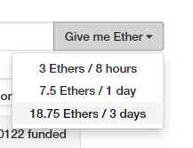

## What is a testnet?

Recall that smart contracts deployments are irreversible: once you deploy a contract, it's on the network for good. Code added to the blockchain is **immutable** and cannot be modified.[^selfdestruct] This means that we have to be _really sure_ that what we deploy is really what we want to deploy, and that means _lots and lots of testing_. No take-backsies!

[^selfdestruct]: Unless, of course, you call [`selfdestruct`](https://docs.soliditylang.org/en/v0.8.4/introduction-to-smart-contracts.html#deactivate-and-self-destruct), which is not particularly common

Of course, local testing on our own local blockchain can only get us so far. That's why there are **testnets**. These are Ethereum protocol-compatible networks that typically distribute tokens for free so that smart contract developers can deploy their contracts to their network first for more realistic testing.

Instead of using proof-of-work, some of these networks use **proof-of-authority** (PoA) for their consensus mechanism to facilitate such features as free token distribution while also keeping costs and complexity low. PoA relies on trusted parties for validation, and is therefore not decentralized, but that should be fine in a testnet.

### Exercise

What's another reason that it might be useful to use a non-decentralized consensus mechanism like PoA in a testnet? Why might it be better to use PoW in a testnet?

[This is a good article](https://medium.com/blockcentric/ethereum-testnets-what-are-they-and-why-so-many-ebf62821bbc) if you're interested in reading a little more about the details of the Ethereum testnets.

## Setting up a Rinkeby.io testnet account

For the purposes of this course we'll be using the [Rinkeby testnet](https://www.rinkeby.io/). However, don't feel tied to any one particular testnet. Although the process of obtaining starter tokens may be a little different, as long as your provider supports the testnet, you'll be fine.

To obtain some free Ether on the Rinkeby testnet, head over to [the faucet page](https://www.rinkeby.io/#faucet), and follow the instructions there.

You'll need a Twitter or Facebook account to make a public post containing the address you wish to fund. It's pretty easy, just paste your address into a tweet, and then paste the link to the tweet into the field on the faucet page. You can delete the tweet afterward if you prefer.

Now just click on the "Give me Ether" button and select whichever timeframe you prefer.

Congratulations, now you have some Ether to spend on the Rinkeby testnet!

## Deploying from Remix with MetaMask

## Deploying our Truffle project with Infura
